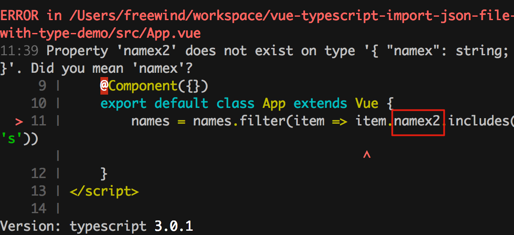
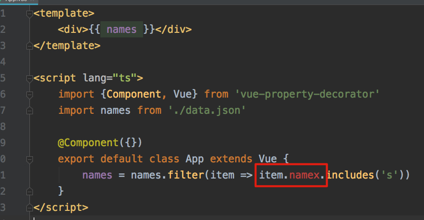

Vue Typescript Import Json File with Type Demo
==============================================

Import a json file and have types of its data.

With typescript 2.9+ `resolveJsonModule` support, typescript can discovery and check the type automatically.

If I use a wrong name `namex2`(other than `namex`), typescript compiler will report errors:



But webstorm's vue support can't recognize the types correctly sometimes:



Run
---

```
npm install
npm run serve
```

Notice
------

To make `resolveJsonModule` work, we need:

1. `package.json` -> typescript version >= 2.9
1. `tsconfig.json`
    1. `"module": "commonjs"`
    1. `"resolveJsonModule": true`
    1. `"include"` includes `"src/**/*.json"`
